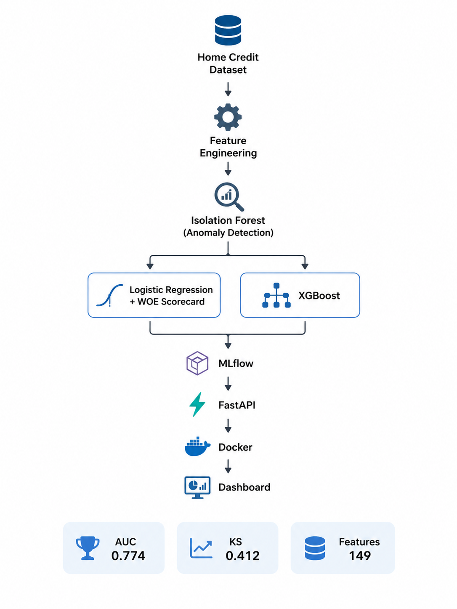
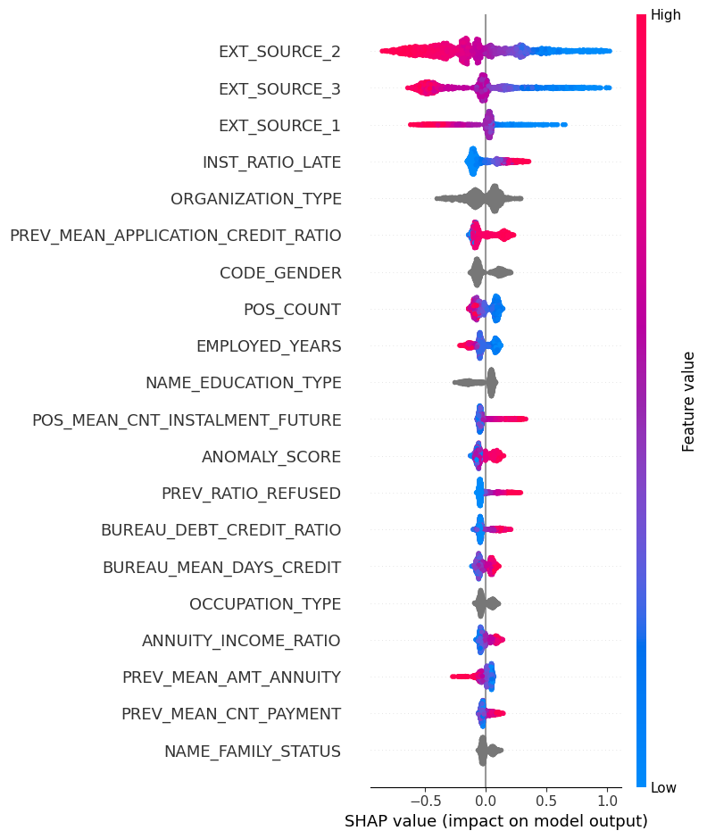
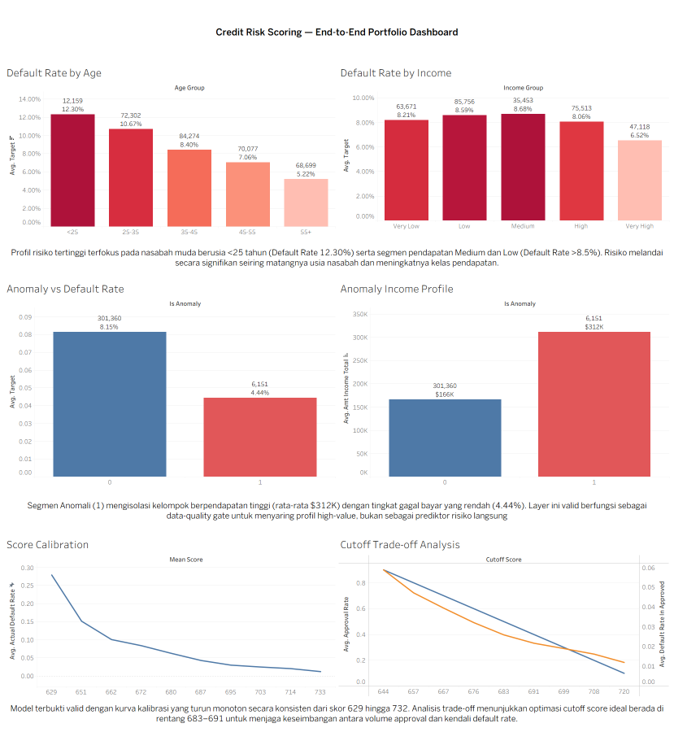

# Credit Risk Scoring – End-to-End Machine Learning Pipeline

An end-to-end credit risk scoring system built using the **Home Credit Default Risk** dataset. The project follows the core principles of the **Basel Internal Ratings-Based (IRB) Approach**, including **Probability of Default (PD) modeling**, **discriminatory power evaluation**, **probability calibration**, and **model stability testing**.

The pipeline incorporates an **anomaly detection layer**, compares two modeling approaches (**Logistic Regression + WOE Scorecard** and **XGBoost**), and includes a complete **MLOps workflow** with model tracking, API deployment, containerization, CI/CD, and an interactive Tableau dashboard.

---

## Dataset Overview

This project is built on the **Home Credit Default Risk** dataset, which consists of one primary application table and multiple relational tables containing applicants' external credit history, previous applications, installment payments, POS cash balances, and credit card transactions.

<p align="center">
  
</p>

<p align="center">
  <em>Figure 1. Relational schema of the Home Credit Default Risk dataset.</em>
</p>
---

## Pipeline Architecture

<p align="center">
  
</p>

<p align="center">
  <em>Figure 2. End-to-End Credit Risk Scoring Pipeline</em>
</p>

---

## Model Performance

| Model                               |   Test AUC |   Test KS | Active Features | Explainability   |
| ----------------------------------- | ---------: | --------: | --------------: | ---------------- |
| Logistic Regression + WOE Scorecard | **0.7672** | **0.400** |              62 | Native Scorecard |
| XGBoost                             | **0.7742** | **0.412** |             132 | SHAP             |

**Top predictive features (consistent across both models):**

- EXT_SOURCE_1
- EXT_SOURCE_2
- EXT_SOURCE_3
- INST_RATIO_LATE
- PREV_RATIO_REFUSED
- BUREAU_DEBT_CREDIT_RATIO
- ANOMALY_SCORE

<p align="center">
  
</p>

<p align="center">
  <em>Figure 3. SHAP Feature Importance for the XGBoost Model</em>
</p>

---

## Key Findings

- **Anomaly Detection**
  - Isolation Forest successfully identified a high-income customer segment (average income ≈ **$312K**) with a significantly lower default rate (**4.44% vs. 8.10%**).
  - The anomaly detector serves primarily as a **data quality layer** rather than a direct credit risk predictor.

- **Customer Risk Profile**
  - The highest default risk is concentrated among applicants **under 25 years old** and those in the **low-to-middle income segment**.

- **Model Calibration**
  - Both models exhibit strong monotonic calibration, with the observed default rate consistently decreasing as the credit score increases (**27.9% → 1.2%**).

- **Feature Engineering Insight**
  - Ratio-based features consistently outperform raw count features across bureau history, installment payments, and previous application records.

---

## Project Structure

```text
├── notebooks/          # EDA, feature engineering, model development (7 notebooks)
├── src/                # Reusable modules (cleaning, feature engineering, anomaly detection, MLflow)
├── api/                # FastAPI application
├── models/             # Trained model artifacts
├── tests/              # Unit tests
├── tableau/            # Tableau dashboard (.twbx)
├── pict/               # Images for the README
├── Dockerfile
└── requirements.txt
```

---

## Interactive Dashboard

The Tableau dashboard provides an interactive overview of applicant characteristics, credit portfolio quality, model performance, risk segmentation, and prediction results, enabling users to explore the model from both business and analytical perspectives.

<p align="center">
  
</p>

<p align="center">
  <em>Figure 4. Interactive Credit Risk Dashboard built with Tableau</em>
</p>

---

## Getting Started

### Run the API with Docker

```bash
docker build -t credit-risk-api .
docker run -p 8000:8000 credit-risk-api
```

Open the interactive API documentation:

```
http://localhost:8000/docs
```

### MLflow Experiment Tracking

```bash
python src/train_with_mlflow.py
mlflow ui
```

### Run Unit Tests

```bash
pytest tests/test_api.py -v
```

---

## Technology Stack

- Python
- pandas
- NumPy
- scikit-learn
- XGBoost
- OptBinning
- SHAP
- MLflow
- FastAPI
- Docker
- GitHub Actions
- Evidently AI
- Tableau

---

## Important Notes

This project adopts the **core principles** of the **Basel Internal Ratings-Based (IRB) Approach** for educational and portfolio purposes, including:

- Probability of Default (PD) modeling
- Discriminatory power evaluation
- Model calibration
- Stability testing

It **is not** an officially IRB-compliant model for regulatory use. Specifically, it does **not** include:

- Loss Given Default (LGD) modeling
- Exposure at Default (EAD) modeling
- Regulatory capital calculations
- Independent model validation by banking regulators

---

## Dataset

**Home Credit Default Risk (Kaggle)**

https://www.kaggle.com/c/home-credit-default-risk

---

## Citation

If you use or reference this project, please also cite the original dataset:

```bibtex
@misc{home_credit_default_risk_2018,
  author = {Ana Lina Morelia and inversion and KirillOdintsov and Martin Kotek},
  title = {Home Credit Default Risk},
  year = {2018},
  publisher = {Kaggle},
  howpublished = {\url{https://kaggle.com/competitions/home-credit-default-risk}}
}
```

**Reference**

## Morelia, A. L., inversion, KirillOdintsov, & Martin Kotek. (2018). _Home Credit Default Risk_. Kaggle. https://kaggle.com/competitions/home-credit-default-risk

## Author

**Khairunnisa Maharani**  
Data Science — Institut Teknologi Sumatera (ITERA)
